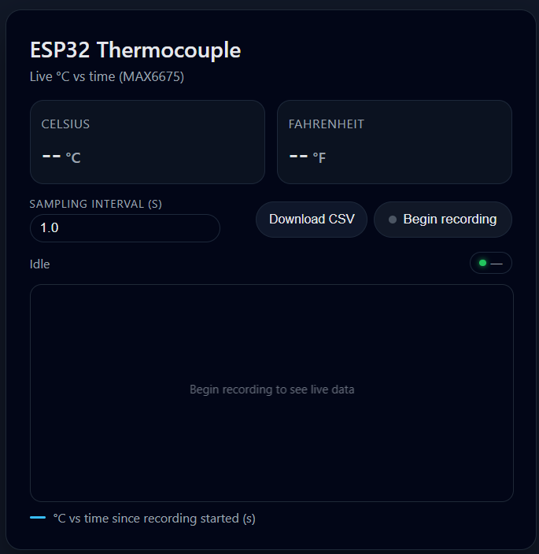

# ESP32 Thermocouple Web Server

A temperature monitoring system using an ESP32 microcontroller and MAX6675 thermocouple amplifier to collect and display real-time data over wifi.

## Features

- **Real-time Temperature Monitoring**: Reads temperature via MAX6675 thermocouple amplifier
- **Web Interface**: Simple HTML interface for remote temperature monitoring
- **Access Point Mode**: ESP32 operates as a WiFi access point for easy connectivity
- **JSON API**: `/readWeb_Thermo` endpoint returns temperature data in JSON format
- **LED Indicator**: Onboard LED activates during temperature sampling

## Hardware Requirements

- ESP32 Development Board
- MAX6675 Thermocouple Amplifier
- K-type Thermocouple Probe
- Jumper wires

## Pin Configuration

| Component | GPIO |
|-----------|------|
| MAX6675 DO (MISO) | GPIO 12 |
| MAX6675 CS | GPIO 15 |
| MAX6675 CLK (SCLK) | GPIO 14 |
| Onboard LED | GPIO 2 |

## Setup

1. Install the required library: `max6675` (available in Arduino IDE Library Manager)
2. Configure WiFi credentials in the sketch (currently `APK_Thermocouple`)
3. Upload the sketch to your ESP32

## Usage

1. Power on the ESP32
2. Connect to the WiFi network `APK_Thermocouple`
3. Open a browser and navigate to the ESP32's IP address (typically `192.168.4.1`)
4. View real-time temperature readings on the web interface

## API Endpoints

- `GET /` - Returns the main HTML page
- `GET /readWeb_Thermo` - Returns JSON with temperature data: `["<celsius>", "<fahrenheit>"]`

## Serial Output

Temperature readings are logged to the serial monitor at 115200 baud.

## Changelog

- **2025-11-26** -  added an index.html file for easier interface editing (remember to copy it to the header file as a string)
- **2024-06-15** - init